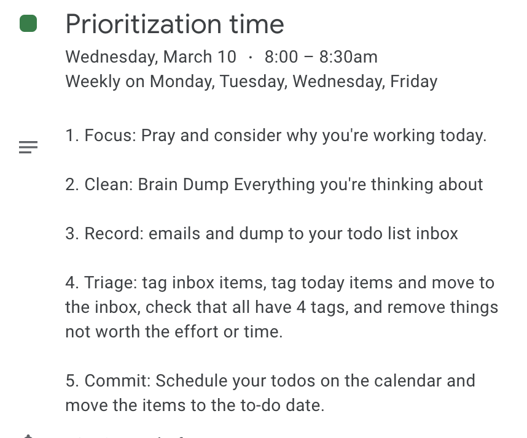

A routine, even if you don't keep it religioously, has the effect of keeping you grounded.

Rythm

Personal commitement.

The ability to change it so slightly as you grow. Adapt it to suit your life.

Starting out small. Maybe just commit to one thing a day. I will do X before I go to bed, or X as I wake up. Then add to. it . Now

Don't keep it religiously. If its not working it's too big/elaborate. Cut it donw to ssomething yo know you'll do.

